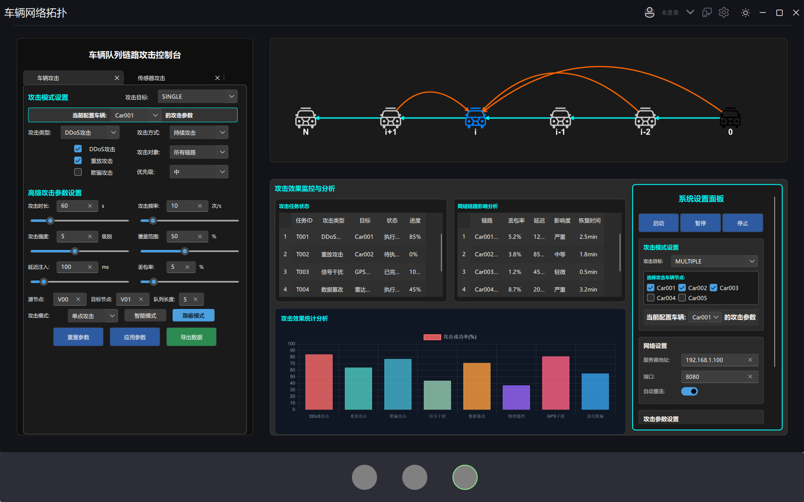
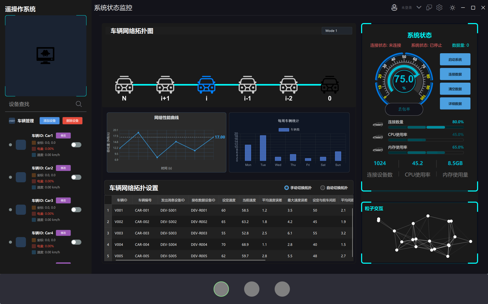
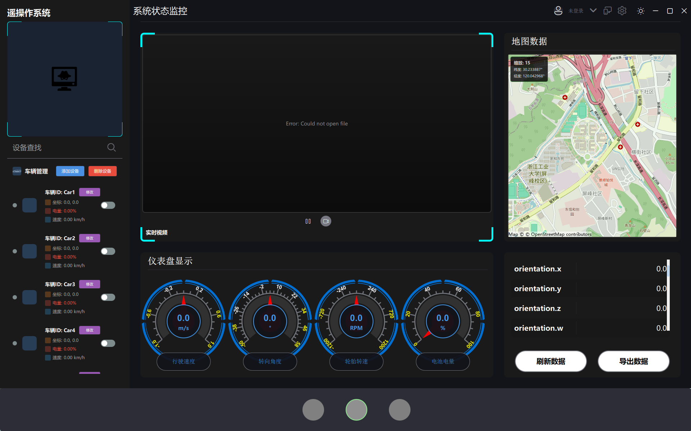

# 智能车辆监控系统 (Smart Vehicle Monitoring System)

[](https://www.qt.io)
[](LICENSE)
[](CMakeLists.txt)

一个基于Qt和FluentUI框架开发的现代化智能车辆监控系统，具备实时数据监控、网络拓扑可视化、攻击检测等先进功能。

## ✨ 核心特性

### 🚗 多模式显示
- **简洁模式**: 科技感仪表盘，专注攻击监控和数据可视化
- **常规模式**: 完整功能界面，集成数据管理、地图、视频监控

### 📊 三大核心页面

#### 1. TechDashboard - 科技感仪表盘
现代化多车辆监控面板，采用FluentUI设计风格，提供8种攻击模式配置和实时网络拓扑可视化



**核心功能：**
- 📈 多车辆实时监控面板
- ⚡ 网络攻击模式参数配置
- 🌐 Canvas绘制的网络拓扑图

#### 2. HomePage - 智能车辆监控系统
车辆数据管理中心，集成网络拓扑可视化、实时数据处理和状态监控功能



**核心功能：**
- 📋 车辆网络拓扑可视化
- 📊 实时数据更新和预处理
- 🎯 车辆状态监控面板
- 📑 结构化数据表格展示

#### 3. LayoutRight - 综合信息显示
集成化信息展示平台，融合地图定位、视频监控和用户管理功能



**核心功能：**
- 🗺️ Qt Location地图集成
- 📹 视频监控区域
- 📊 车辆仪表盘显示
- 👤 用户信息配置界面

### 🔧 技术架构

#### 前端技术
- **Qt 6.9.2+**: 跨平台应用框架
- **FluentUI**: 现代化UI组件库
- **QML**: 声明式UI设计语言
- **Qt Location**: 地图服务集成

#### 后端技术
- **C++17**: 核心业务逻辑
- **CMake**: 现代化构建系统
- **TCP/IP**: 网络通信协议

#### 数据模型
- **VehicleDataModel**: 车辆数据结构管理
- **AttackDataModel**: 攻击参数配置
- **SharedNetworkConnection**: 网络数据共享

## 🚀 快速开始

### 环境要求
- Qt 6.9.2 或更高版本
- CMake 3.16+
- C++17 兼容编译器
- Windows/macOS/Linux 操作系统

### 构建步骤
```bash
# 克隆项目
git clone https://github.com/wusi-maker/Remote-operating.git
cd Remote-operating

# 创建构建目录
mkdir build && cd build

# 配置项目
cmake ..

# 构建项目
cmake --build .

# 运行应用
./src/test
```

### 开发环境配置
```bash
# Windows (MinGW)
cmake -G "MinGW Makefiles" ..

# macOS/Linux
cmake -G "Unix Makefiles" ..
```

## 📁 项目结构

```
Remote-operating/
├── src/                    # 源代码目录
│   ├── main.cpp           # 应用入口
│   ├── main.qml           # 主QML文件
│   ├── App.qml            # 应用根组件
│   ├── Src/               # QML组件目录
│   │   ├── commonUI/      # 通用UI组件
│   │   ├── leftPage/      # 左侧页面组件
│   │   ├── rightPage/     # 右侧页面组件
│   │   ├── nightPage/     # 底部页面组件
│   │   ├── style/         # 样式和主题
│   │   └── Network/       # 网络相关组件
│   └── Resource/          # 资源文件
├── FluentUI/              # FluentUI框架
├── docs/                  # 项目文档
├── examples/              # 示例和演示
├── CMakeLists.txt         # CMake构建配置
└── .gitignore            # Git忽略规则
```

## 📝 开发文档

详细开发文档请查看 [docs/README.md](docs/README.md)

博客写作指南请查看 [docs/blog-guide.md](docs/blog-guide.md)

## 🤝 参与贡献

我们欢迎所有形式的贡献，无论是代码、文档、测试还是建议。如果您有好的想法或发现了问题，请随时参与：

1. **Fork 项目** - 从主分支创建您的副本
2. **创建分支** - (`git checkout -b feature/AmazingFeature`)
3. **提交更改** - (`git commit -m 'Add some AmazingFeature'`)
4. **推送分支** - (`git push origin feature/AmazingFeature`)
5. **创建PR** - 提交Pull Request并描述您的更改

## 🐛 问题与建议

您的反馈对我们非常重要！如果您在使用过程中遇到任何问题或有改进建议：

1. **查看文档** - 首先查看[项目文档](docs/)了解常见问题和解决方案
2. **搜索Issues** - 在[问题列表](https://github.com/wusi-maker/Remote-operating/issues)中搜索类似情况
3. **创建Issue** - 详细描述您遇到的问题或建议，包括：
   - 问题描述和复现步骤
   - 系统环境和版本信息
   - 错误日志或截图
   - 期望的行为

我们承诺认真对待每一个反馈，并持续改进项目质量。

## 📄 许可证

本项目采用 MIT 许可证 - 查看 [LICENSE](LICENSE) 文件了解详情。

## 🙏 致谢

- [Qt Framework](https://www.qt.io/) - 跨平台应用开发框架
- [FluentUI](https://github.com/zhuzichu520/FluentUI) - 现代化UI组件库
- [QCustomPlot](https://www.qcustomplot.com/) - 图表绘制库

## 📞 联系方式

- 项目维护者: [wusi-maker](https://github.com/wusi-maker)
- 邮箱: [1979837154@qq.com]
- 博客: [wusi-maker.github.io](https://blog.csdn.net/weixin_51626643)

---

⭐ 如果这个项目对您有帮助，请给个Star支持一下！